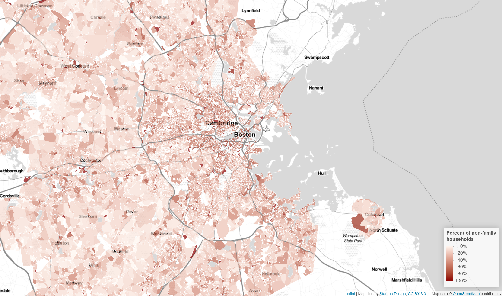
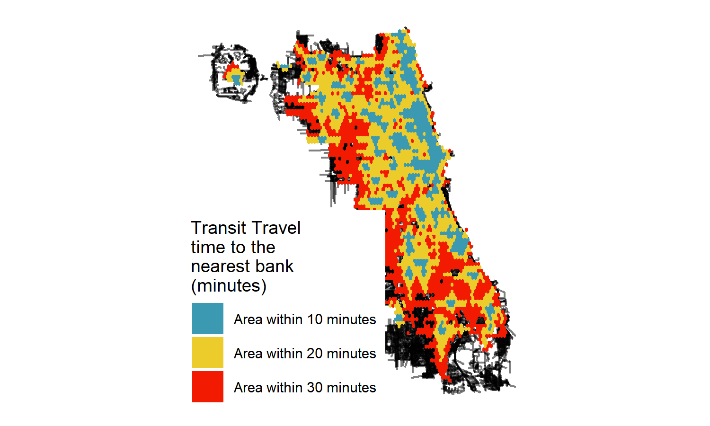
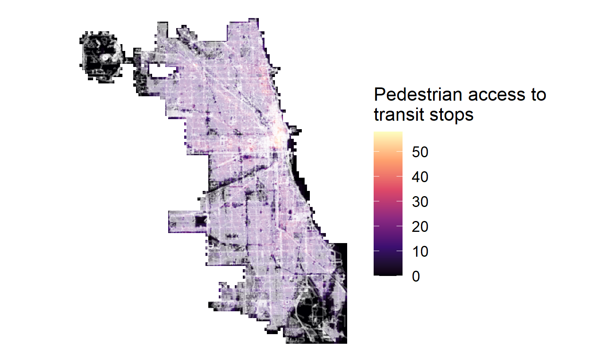
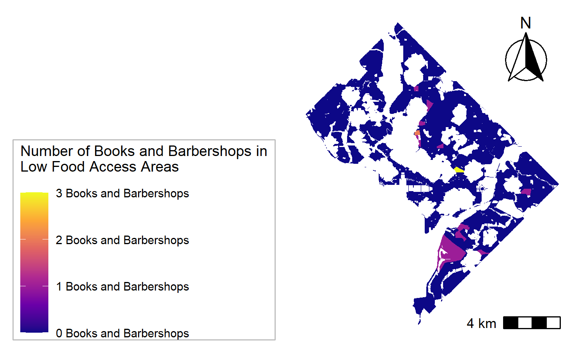

```{r setup, include=FALSE}
knitr::opts_chunk$set(echo = TRUE)
```

# Introduction

This portfolio was created as part of the Spatial Analysis course, a first semester planning course at the Harvard University Graduate School of Design. The maps utilize skills learned over the past seven weeks in both R and ArcGIS. The projects range across three geographies - Boston, Chicago, and Washington, DC - and use a variety of different data types and methods of representation and analysis. 

# Maps of Boston

## Interactive Map

Boston has a plethora of universities, and with those universities come a large number of students who require living accommodations. This interactive map shows the percentage of non-family households in the greater Boston area by census block group. While not all non-family households are made up of students, there is an especially high concentration of these households near the university sites, as well as major transit lines and roads. Clicking on an individual census tract block group brings up additional information on the number of people in each non-family household, which ranges from one to six. 

[](https://ebonanno2.github.io/bonanno_portfolio/fullsize/boston_nonfamily.html){target="_blank"}

## Georeferencing East Boston

This project explores the history of land infill and development in East Boston. The map below layers current roads and city boundaries over a historic map of East Boston from 1911, highlighting the areas that were created through
landfill in order to build Logan International Airport, as well as the areas that were demolished. Seen ajust outside of the current city boundaries layer is the historic Wood Island Park, designed by Frederick Law Olmsted in 1898 and demolished in 1969 to make way for the airport expansion.

[](https://ebonanno2.github.io/bonanno_portfolio/fullsize/East_Boston_georeferencing.pdf){target="_blank"}

Data sources: Boston Maps. City of Boston Boundary. Boston: Boston Maps. Boston Maps, 2020-12-07. Geospatial. 09-14-2021.
Boston Maps. Boston Street Segments. Boston: Boston Maps. Boston Maps, 2020-12-07. Geospatial. 09-14-2021.
Boston Maps. Open Space. Boston: Boston Maps. Boston Maps, 2020-12-07. Geospatial. 09-14-2021.
Base Map Source: Frank L. Tiffetts. Plan Showing Location of the Property of the East Boston Company in the East Boston and Vicinity. Boston: East Boston Company, 1911.

# Maps of Chicago

## Isochrones

This map displays isochrones based on transit travel time from any point on a citywide grid to the nearest banking institution, utilizing data from the Chicago Transit Authority (CTA). The code allows up to a 1000 meter walk to reach a transit stop.

[](https://ebonanno2.github.io/bonanno_portfolio/fullsize/Chicago_banks_isochrone.pdf){target="_blank"}

## Accessibility

This map shows overall transit accessibility within the city of Chicago based on a distance-decay function of the walking time to the nearest transit stop.

[](https://ebonanno2.github.io/bonanno_portfolio/fullsize/Chicago_accessibility.pdf){target="_blank"}


# Maps of Washington, D.C.

## Books and Barbershops and Low Food Access Areas

The Books and Barbershops program is an attempt to raise awareness of the value of academic mentoring and early childhood literacy, both basic community needs. This map looks at the locations of these data points in reference to a dataset that demonstrates unequal access to another basic need - food. The goal was to determine whether the Books and Barbershops locations would appear in the low-access food areas, a potential indication of a community that is currently being underserved. However, as seen with the map, the Books and Barbershops initiative seems to occur mostly in areas without low-access to food.

[](https://ebonanno2.github.io/bonanno_portfolio/fullsize/BB_low_food.pdf){target="_blank"}

